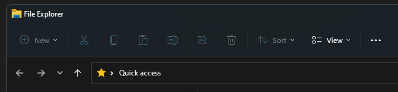

# WindowsTips

Чтобы применить настройки, нужно создать текстовый `.reg` файл, и вписать:

```
Windows Registry Editor Version 5.0
```

Далее на новой строке просто впишите те настройки которые хотите применить:

<hr>

## Контекстное меню (правая кнопка мыши)


Чтобы попасть в старое контекстное меню 
приходится делать по два клика вместо одного. Чтобы сделать старое меню основным, используйте эту настройку:


```
[HKEY_CURRENT_USER\Software\Classes\CLSID\{86ca1aa0-34aa-4e8b-a509-50c905bae2a2}\InprocServer32]
@=""
```
<hr>

## Верхняя панель в проводнике



Чтобы вернуть старую верхнюю панель настроек в проводнике, используйте настройку:

```
[HKEY_LOCAL_MACHINE\SOFTWARE\Microsoft\Windows\CurrentVersion\Shell Extensions\Blocked]
"{e2bf9676-5f8f-435c-97eb-11607a5bedf7}"=""
```

## Применение настроек

Чтобы применить настройки, запустите ваш `.reg` файл двойным кликом и подтвердите действие.
Изменения применятся после перезапуска системы.
