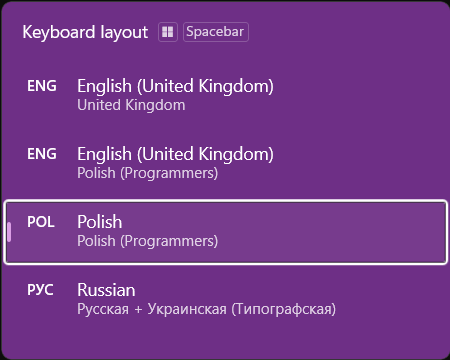
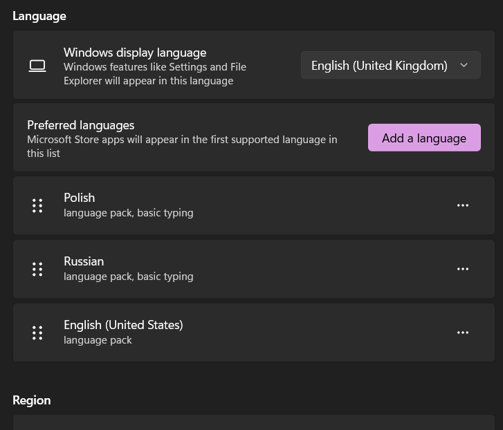

# WindowsTips

Іноді можна помітити, що у Windows з'явилися зайві розкладки мов



Але в налаштуваннях введення їх чи немає, або вони там не всі.



На різних комп'ютерах це відбувається по-різному, але переважно з'являються розкладки типу. `English (United Kingdom)`.

Найпростіший спосіб видалити такі розкладки, яких немає у списку налаштувань, це додати їх вручну (тоді вони з'являться у списку) і після цього видалити їх.
Важливо, що додати треба саме ту розкладку, яка є зайвою (наприклад саме `English (United Kingdom)`)

Далі, можна написати простий powershell скрипт, який це робить.
Виглядає він приблизно так:
```powershell
$LangList = Get-WinUserLanguageList #getlist

$LangList[0].InputMethodTips.Add('0409:00000415') #pl programmers
$LangList[0].InputMethodTips.Add('0419:A0000419') #ru-ua
$LangList[0].InputMethodTips.Add('0409:00000409') #en-us

Set-WinUserLanguageList $LangList -Force
$LangList = Get-WinUserLanguageList

$LangList.Remove(($LangList | Where-Object LanguageTag -like 'en-US'))

$LangList = Get-WinUserLanguageList
$LangList.Remove(($LangList | Where-Object InputMethodTips -like '0409:00000409')) #en-us

Set-WinUserLanguageList $LangList -Force
```

Ідентифікатори локалізації (`0409:00000415`) треба підібрати вручну такі, які вам потрібні, взяти їх можна [тут](https://docs.microsoft.com/en-us/windows-hardware/manufacture/desktop/default-input-locales-for-windows-language-packs).

1. Скрипт повинен витягнути розкладки з налаштувань до списку

    ```powershell 
    $LangList = Get-WinUserLanguageList
    ```
    
    Також можна просто ввести команду `Get-WinUserLanguageList` в консоль powershell, і подивитися ідентифікатори розкладок
    
    *тут будуть показані тільки ті, які буде видно в налаштуваннях перемикання розкладок.

2. Скрипт повинен додати зайві розкладки до списку

    ```powershell
    $LangList[0].InputMethodTips.Add('0409:00000409') #en-us
    
    $LangList[0].InputMethodTips.Add('...')
    ```

3. Застосувати зміни (без цього не працюватиме)

    ```powershell
    Set-WinUserLanguageList $LangList -Force
    ```

4. Далі потрібно знову витягнути всі розкладки в змінну, видалити зайві та застосувати зміни

    ```powershell
    $LangList = Get-WinUserLanguageList

    $LangList.Remove(($LangList | Where-Object LanguageTag -like 'en-US'))`

    $LangList = Get-WinUserLanguageList
    
    $LangList.Remove(($LangList | Where-Object InputMethodTips -like '0409:00000409'))
    
    Set-WinUserLanguageList $LangList -Force
    ```

    Видаляти можна як через `'0409:00000409'` так і через `'en-US'`

Після кожного видалення розкладки потрібно витягувати всі розкладки в змінну, в консолі має з'явитися `True` що свідчить про успішне видалення.

Зміни слід застосовувати відразу після відпрацювання скрипта.
